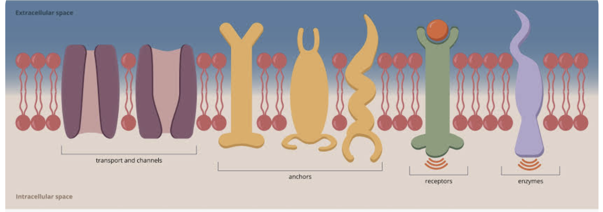

# 1.3 膜的结构（Membrane structure）

> [!question] 为什么说第一个模型「暗示」了对称性？
> 「第一个模型」指**戴维森-达尼埃利模型（Davson–Danielli model）**。它认为磷脂双分子层的**内、外两侧都覆盖着一层相同的球状蛋白薄膜**（protein–lipid–protein 的三明治结构）。
> - **对称（symmetrical）**：因为膜两侧被描绘成结构相同——都是同一层蛋白覆盖，内外两面互为镜像，没有区别。
> - **完全相同（identical）**：这个模型是一个「通用模板」，暗示所有细胞膜都长得一样，没有考虑不同膜在成分和功能上的差异。
>
> 而实际观察发现：膜两侧的蛋白种类和分布并不一致（如糖蛋白只朝向膜外侧），不同功能的膜结构也不同。正是这种**不对称性与多样性**成为辛格-尼科尔森模型（流动镶嵌模型）取代它的理由之一。
>
> > [!question] 难道 Davson 模型不能修正成「两侧蛋白种类不同」吗？
> > 这个问题触及了「**修正一个模型**」和「**推翻一个模型**」的区别。答案是：能微调，但改不动它的核心，所以只能被推翻。
> >
> > **① 对称性只是「表面症状」，不是致命伤**
> > 说得对——如果问题**仅仅**是「两侧蛋白种类不同」，确实可以给模型打补丁：把外层画成 A 蛋白、内层画成 B 蛋白，对称性问题就解决了。所以对称性这条其实是最弱的一条理由。真正让它无法修补的是下面两条。
> >
> > **② 真正改不动的核心假设：蛋白在「表面」**
> > Davson-Danielli 模型的**本质定义**就是：蛋白铺在磷脂双分子层的**外表面**，形成连续薄层（protein–lipid–protein 三明治）。而证伪它的关键证据攻击的正是这一条：
> > - **热力学/化学**：球状蛋白大多**非极性（疏水）**，把一整层疏水蛋白摊在与水接触的膜表面，能量上不合理——蛋白的疏水部分会倾向于**躲进膜内部**。
> > - **冰冻蚀刻电镜（freeze-fracture）**：把膜从中间劈开，在**双分子层内部**看到了颗粒状蛋白凸起，说明蛋白**嵌在膜里**而非贴在表面。
> >
> > 这没法靠「换两侧蛋白种类」修补——问题不在「哪种蛋白」，而在「蛋白根本不该在表面」。一旦承认蛋白嵌入膜内，它就已经不是 Davson-Danielli 模型，而是 Singer-Nicolson 模型了。
> >
> > **③ 静态 vs 流动**
> > Davson-Danielli 模型隐含膜是**静态、刚性**的；而细胞融合实验证明两个细胞的膜蛋白会互相混合，即膜是**流动**的。这也是「三明治」结构装不下的。
> >
> > | 问题 | 能否靠打补丁解决？ |
> > |---|---|
> > | 两侧蛋白种类不同（对称性） | ✅ 能，只是细节 |
> > | 蛋白嵌在膜内而非表面 | ❌ 不能，改了就不是原模型 |
> > | 膜是流动而非静态 | ❌ 不能 |
> >
> > **小结**：科学史把它算作「被证伪（falsified）后被取代」而非「被修正」，因为要修复的不是它的**参数**，而是它的**核心假设**。对称性那条只是压垮它的众多证据里最轻的一根稻草。

- 蛋白质层的假设不太可能成立，因为蛋白质在很大程度上是非极性的（non-polar），不容易与水（water）界面接触——细胞研究也证实了这一点。

> [!question] 这条逻辑链拆开来讲
> 原句省略了好几步，补齐如下：
>
> **① 什么叫「非极性（non-polar）」？**
> 分子内电荷分布均匀、没有明显正负两端的，叫非极性；反之电荷分布不均、有正负端的叫极性。蛋白质表面既有极性氨基酸也有非极性氨基酸，但戴维森-达尼埃利模型设想的那层「球状蛋白」整体上有大量非极性（疏水）区域。
>
> **② 为什么非极性就不容易与水接触？**
> 水是**极性**分子，遵循「相似相溶（like dissolves like）」——极性物质亲水，非极性物质疏水。非极性区域与水接触时无法与水形成有利的作用，会迫使周围水分子重新排列、代价很高，所以在能量上**倾向于避开水、彼此聚在一起**（疏水效应）。这也是磷脂双分子层能自发形成的同一个原理：疏水尾巴朝内躲开水。
>
> **③ 为什么「不容易与水接触」就能否定 Davson 模型？**
> 关键正是你的猜测——**是的，因为膜的两个表面都泡在水里**。回顾 1.2 节：细胞内的**细胞质（cytoplasm）**和细胞外的**组织液（tissue fluid）** 本质都是水溶液。而 Davson-Danielli 模型偏偏把蛋白层**铺在双分子层的内、外两个表面**，也就是把大量疏水蛋白直接摊在水environment里——这在能量上是不利、不稳定的。
>
> **④ 所以正确的结论是什么？**
> 疏水的蛋白部分应该**躲进膜内部**（远离水的双分子层疏水核心），而不是暴露在表面。这正指向辛格-尼科尔森模型：蛋白**嵌入（embedded）** 在膜中，亲水部分露在水侧、疏水部分埋在膜内。于是「表面蛋白层」的假设被否定。

> [!question] 为什么说维持膜结构的关键是「水分子形成氢键的倾向」？
> 这句话点出一个反直觉但关键的原理：**双分子层不是被脂质之间的吸引力"粘"起来的，而是被水"挤"出来的**——驱动力来自水，不来自磷脂。
>
> **1. 水分子"喜欢"彼此形成氢键。** 水是极性分子，水分子之间可以形成氢键，大量氢键网络是水最"舒服"、能量最低的状态。
>
> **2. 疏水尾巴插在水中，会打断这个氢键网络。** 脂肪酸尾巴是非极性的，无法与水形成氢键。尾巴暴露在水里时，紧贴它的那一圈水分子只能与旁边的水分子形成氢键，被迫摆成有序的"笼子（clathrate）"结构。注意：这些水分子恰恰是靠**维持甚至增多氢键**来搭成笼子的，所以真正的代价不在"焓（能量）升高"，而在**熵降低（有序度上升、混乱度下降）**——正是这一项让系统自由能升高、感到"不舒服"。（这也是为什么疏水效应在室温下**以熵驱动为主**。）
>
> **3. 于是水把疏水尾巴"排挤"到一起。** 为让代价最小，系统自发让尾巴彼此靠拢、聚成一团：尾巴聚在一起后与水的接触面积大大减少，需要"被迫排队"的水分子就少了，水分子得以恢复自由地彼此形成氢键。这才是"相似相溶"背后更准确的机制——**不是油喜欢油，而是水更愿意跟水在一起**。（原文说"脂肪酸尾巴之间的吸引力并不强"，正是在强调：真正把它们推到一起的是水，而不是尾巴之间的吸引力。）
>
> **4. 结果就是自发的双分子层。** 疏水尾巴躲进膜内部、远离水，维持了水分子氢键网络的完整；亲水的磷酸化头朝向膜两侧的水环境——头是极性的，能和水形成氢键，所以愿意留在水侧。
>
> **5. 为什么这是"维持结构"的关键？** 双分子层一旦形成，若被扰动（比如把一条尾巴拽到水里），就会重新制造"尾巴暴露、水被迫排队"的高能状态。所以这个结构在能量上是**自稳定**的，一旦形成就倾向于维持——这正是把"水分子形成氢键的倾向"称作维持膜结构关键的原因。
>
> **一句话总结**：水分子之间形成氢键是最有利的状态，疏水尾巴妨碍了这件事，于是水把尾巴"赶"进膜内部、自己留在膜外自由保持氢键网络——双分子层就在这种驱动下自发形成并维持。这与前文"非极性蛋白不易与水接触"是同一个原理：**疏水效应（hydrophobic effect）**，它本质上是水分子氢键网络的性质，而非疏水分子自身的性质。

> [!question] 既然动物需要胆固醇来维持膜的流动性，为什么健康食谱又把胆固醇视为大敌？既然课本说饱和脂肪酸和不饱和脂肪酸是植物才有、动物没有，那营养学把某种脂肪酸说得"更高级"，是不是伪科学式的智商税？
> > [!note] 回答
> > 好问题——你其实一口气抓到了两个真实的坑：一个是**课本表述本身不严谨**，一个是**营养学传播被过度简化**。分开说。
> >
> > **一、先纠正课本给你造成的误会**
> >
> > 课本那句"植物才有饱和/不饱和脂肪酸"——**这是句会误导人的话，字面意思是错的。**
> >
> > 动物和植物**都有**饱和脂肪酸和不饱和脂肪酸。你身上的每一层细胞膜、你吃的肥肉、鱼油，全都是脂肪酸构成的，既有饱和也有不饱和。
> >
> > 课本真正想说的是**"调节膜流动性的机制不同"**：
> >
> > | | 怎么维持膜流动性 |
> > |---|---|
> > | 动物 | 主要靠**胆固醇**当"缓冲剂"——温度高时它限制流动、温度低时它防止膜冻结变硬 |
> > | 植物/真菌 | 没有胆固醇，只能靠**调整膜里饱和 vs 不饱和脂肪酸的比例**（不饱和脂肪酸的双键会"折弯"尾巴，让膜更松、更流动） |
> >
> > 所以不是"动物没有脂肪酸"，而是"动物多了一个胆固醇这个工具"。课本省略主语省得太狠了。
> >
> > **二、"膜需要胆固醇"和"健康食谱怕胆固醇"矛盾吗？**
> >
> > 不矛盾，因为**这是两件事**：
> >
> > 1. **你身体需要的胆固醇，绝大部分是自己合成的**（主要在肝脏），不靠吃。哪怕你一口胆固醇不吃，肝脏也会造够。
> > 2. 健康建议担心的从来不是"细胞膜里的胆固醇"，而是**血液里的胆固醇（尤其是 LDL）过高会沉积在血管壁，导致动脉粥样硬化**。
> >
> > 而且这里有个**重要更新**：现代营养学已经**给"膳食胆固醇"平反了一大半**。
> > - 鸡蛋、虾这类"高胆固醇食物"，对大多数人的血脂影响其实很小。
> > - 美国膳食指南 2015 年起就**取消了每天 300mg 胆固醇的上限**。
> >
> > 所以"胆固醇=大敌"这个说法，本身就是**过时的、被简化的旧观念**——你的怀疑方向是对的。
> >
> > **三、那"某种脂肪酸更高级"是智商税吗？**
> >
> > 这里要分层看，**不能一棍子打死**：
> >
> > **真有科学依据的部分**（不是智商税）：
> > - 真正和心血管病相关的，主要是**反式脂肪酸**（人造氢化油，如植脂末、部分廉价烘焙），这个证据非常硬，各国都在禁——它是真·坏东西。
> > - **饱和脂肪 vs 不饱和脂肪**：大量证据显示，用不饱和脂肪（橄榄油、坚果、鱼）替换一部分饱和脂肪（肥肉、黄油），平均能降低心血管风险。这是统计学上的群体趋势，不是玄学。
> >
> > **确实被商业滥用、有智商税成分的部分**：
> > - "Omega-3 保健品""深海鱼油胶囊"抗一切病——大量高质量试验显示对普通人**没那么神**。
> > - "零胆固醇植物油"当卖点——植物油本来就几乎不含胆固醇，属于**正确的废话式营销**。
> > - 把食物简单粗暴分成"好脂肪/坏脂肪"、非黑即白——这是**传播的锅**，不是科学的结论。
> >
> > **一句话总结**
> >
> > - 课本那句话**表述有误**，动植物都有各类脂肪酸，区别只在"用不用胆固醇调膜"。
> > - "怕膳食胆固醇"是**过时观念**，你的直觉没错。
> > - 但"不饱和脂肪整体优于饱和/反式脂肪"**不是伪科学**——它是靠得住的群体统计规律，只是被营养品行业和媒体**过度简化+商业包装**，那层包装才是智商税。
> >
> > 科学的真实结论往往是"平均、概率、程度"，而营销和标题党喜欢改写成"绝对、神奇、非黑即白"——你闻到的智商税味道，大多来自后者，不是来自生物学本身。

> [!NOTE]
> 膜蛋白的功能对宏观生命体至关重要，它们是让细胞能够正常运作并维持生命活动的核心组件 。 从这张图像中，我们可以直观地看到各种膜蛋白是如何在细胞膜上各司其职的。
>  
>  首先，看图像的左侧，这里展示了负责物质运输和通道的蛋白质，它们就像是细胞的城门，控制着营养物质的进出与废物的排出 。往右看，中间的一组蛋白质被称为锚定蛋白，它们负责细胞的黏附与定位，将细胞固定在正确的位置或者与其他细胞连接起来 。再往右，我们可以看到受体蛋白，它正在接收外部的红色信号分子，这种信号转导机制让细胞能够感知外界环境并做出反应，比如协调身体对激素的调节 。最右侧则是酶类蛋白，它们在细胞膜上直接催化各种必要的化学反应 [1]。 正是因为这些微观膜蛋白的协同工作，宏观生命体才能顺利进行物质代谢、传递神经信号并维持内环境的稳定 。

这些微观的膜蛋白功能，正是==支撑起宏观生命体生存、运转与演化的核心基石==。如果把单个细胞比作一块"砖"，宏观生命体（如人类、动植物）就是一座结构极其复杂的"摩天大楼"。如果没有膜蛋白，这座大楼会在瞬间坍塌。

微观功能转化为宏观价值的具体体现如下：

#### 1. 激素结合位点 $\rightarrow$ 宏观价值：全身系统的协同与统筹

- 微观机制： 膜蛋白作为受体，精准捕捉血液中的激素（如胰岛素、肾上腺素）。
- 宏观价值： 实现全身各器官的"步调一致"。例如，当你在宏观上遇到危险（如遇到猛兽）时，大脑发出信号释放肾上腺素。全身数万亿个细胞通过膜蛋白受体接收到这一信号后，心脏细胞加速跳动、骨骼肌血管扩张、肝脏释放葡萄糖。这种微观的"信号传递"，最终转化为了宏观上动物"战斗或逃跑"的生存本能。

#### 2. 被动通道与主动泵 $\rightarrow$ 宏观价值：维持内环境稳定与生死防线

- 微观机制： 通过泵（消耗 ATP）和通道，严格控制钠、钾、钙等离子进出细胞。
- 宏观价值： 让生命体能够思考、运动并维持基本的生命体征。

    - 神经与运动： 神经元和肌肉细胞上的离子泵与通道，是产生"动作电位"（电信号）的基础。没有它们，你就无法产生任何思维、无法眨眼、心脏也无法跳动。
    - 渗透压平衡： 肾脏细胞利用大量的膜蛋白进行重吸收——**水通道蛋白（aquaporin）负责重吸收水分**，而**钠钾泵及各类离子转运体负责重吸收盐（离子）**（水通道蛋白本身只运水、不运盐）。这在宏观上表现为维持血压稳定、防止身体脱水或水肿。

#### 3. 细胞黏附与间隙连接 $\rightarrow$ 宏观价值：构建复杂的组织与器官

- 微观机制： 一类**黏附类连接蛋白**（如桥粒 desmosome、黏着连接、紧密连接）像纽扣或胶水一样把细胞永久或临时地钩在一起；另一类**间隙连接（gap junction）** 则在相邻细胞间建立物质/离子交换的通道（其核心功能是**通讯**，而非机械黏附）。
- 宏观价值： 让多细胞生命体成为可能，而非一滩松散的细胞黏液。

    - 结构支撑： 皮肤（表皮）细胞主要通过**桥粒（desmosomes）** 牢牢结合，在宏观上形成了阻挡病原体入侵的第一道物理屏障（紧密连接则在肠道上皮、血脑屏障等处充当"密封条"）。
    - 器官泵血： 心肌细胞之间通过"间隙连接"相连，电信号可以瞬间传遍整个心脏，从而实现心肌细胞的同步齐射收缩，完成高效的宏观泵血功能。

#### 4. 细胞间通讯（糖蛋白标签） $\rightarrow$ 宏观价值：免疫防御与自我识别

- 微观机制： 膜表面的糖蛋白作为"身份标签"（抗原），供免疫细胞识别。
- 宏观价值： 保障生命体的免疫安全，区分"敌我"。

    - 免疫细胞（如白细胞）在体内巡逻时，通过触摸这些膜蛋白标签来判断对方是"自己人"还是"入侵者"（如细菌、病毒）。
    - 宏观上，这保证了我们不会轻易被环境中的微生物吞噬，同时也决定了人类的血型系统以及器官移植时的排异反应。

#### 5. 酶催化作用 $\rightarrow$ 宏观价值：高效的能量转换与代谢

- 微观机制： 膜蛋白酶排列成代谢途径，像流水线一样依次催化化学反应。
- 宏观价值： 保障宏观生命体源源不断的能量供应。

    - 线粒体内膜上排列着极为复杂的呼吸链膜蛋白（酶复合体），它们高效地将你吃进去的食物转化为 ATP（能量货币）。
    - 宏观上，这支撑了你的体温维持、生长发育、体力劳动等一切消耗能量的活动。

---

总结来说：
单一细胞的盲目存活没有意义。膜蛋白就像是细胞的"眼、耳、口、鼻、手和身份证"。正是因为它们在微观上让细胞能够互相看见、互相握手、传递物资、服从指挥，宏观生命体才能从"一堆细胞"进化为结构精巧、拥有高级智慧与行为能力的复杂生物。

